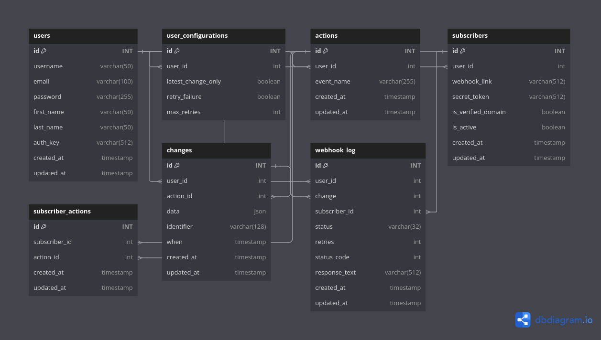

# GoHOOK (Webhook as a Service)

Service to companies to register there action and subscriber and we fo the reset

Company only send the change to `GoHook` and it podcast the change to all subscibers on there webhooks

## Database Design


**basically we have** 
- (actions/ subscribers / pivot table between them)
- changes
- webhook log
- user 

## System Design ##

> Mainly when `GoHook` receive change and store it in the
> database it send the change to `Rabbit MQ` which provide 
> durability and stability making sure we never lose a change
> 
> **Change create only one task for now**
> 
> Later we have consumer to take the task from `changes` queue and get subscribers create tasks for each one
> and notify RabbitMQ that change is DONE
> 
> in case worker broke down then task will not mark as done
> 
> **Now we have task for each subscriber and change**
> 
> Split tasks make us sure that each one is done and if some one failed we can retry it as much as we want


#### Behavior based on user configuration

> SEND ONLY LAST CHANGE AND IGNORE OTHERS
> 
> on change come to the endpoint `GoHook` store the `task_id` provided by user and the `when` field
> 
> and before sending the data to webhook we check the time to the latest one stored to this task id, if it grater or equal
> we send data to webhook

#### Undone behaviors

> BATCH CHANGES TO WEBHOOK
> 
> instead of sending changes one by one to the same webhook we can batch them by creating an array in redis hold any change came
> 
> and schedule task to send these queues every 3 minutes or whatever
> 
> UNDONE because the latency, `GoHook` don't want to wait and make users late

## Installation

You just want to run this command
```bash
docker compose up
```


## Whats next

- [ ] list pagination
- [ ] create subscriber actions in bulk
- [ ] create action subscribers in bulk
- [ ] Scope qs to user